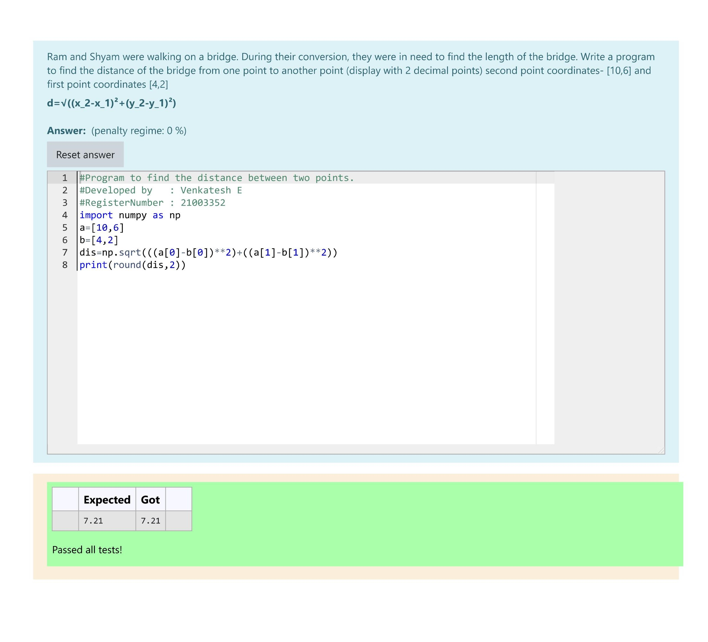

# DISTANCE-BETWEEN-TWO-POINTS

## AIM:
To write a python program to find the distance two 2 points
## ALGORITHM:
### Step 1: 
Import the numpy module to use the built-in functions for calculation
### Step 2:
Prepare the lists from each linear equations and assign in np.array() 
### Step 3: 
Substitute the values in the distance formula  
### Step 4:
End the program 
### PROGRAM:
~~~
#Program to find the distance between two points.
#Developed by   : Venkatesh E 
#RegisterNumber : 21003352
import numpy as np
a=[10,6]
b=[4,2]
dis=np.sqrt(((a[0]-b[0])**2)+((a[1]-b[1])**2))
print(round(dis,2))
~~~
### OUTPUT:

### RESULT:
Thus we found the distance between two points successfully using python program